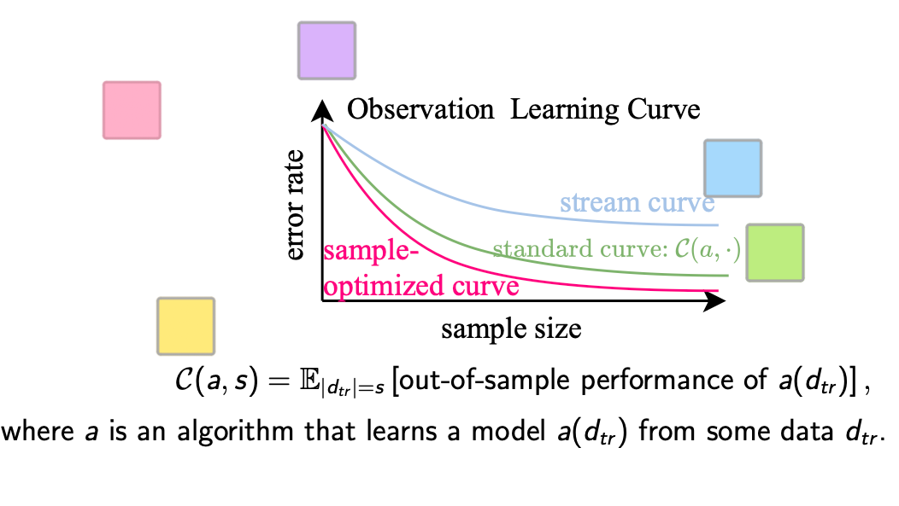
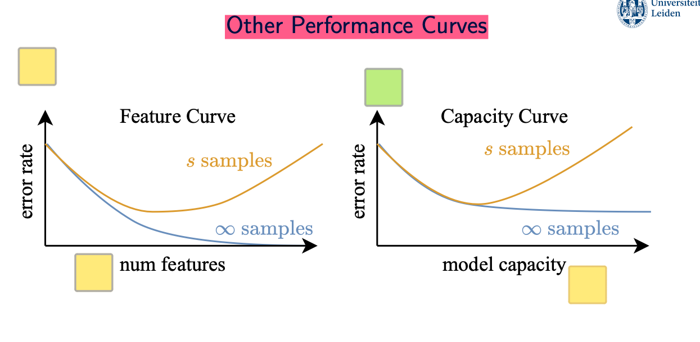
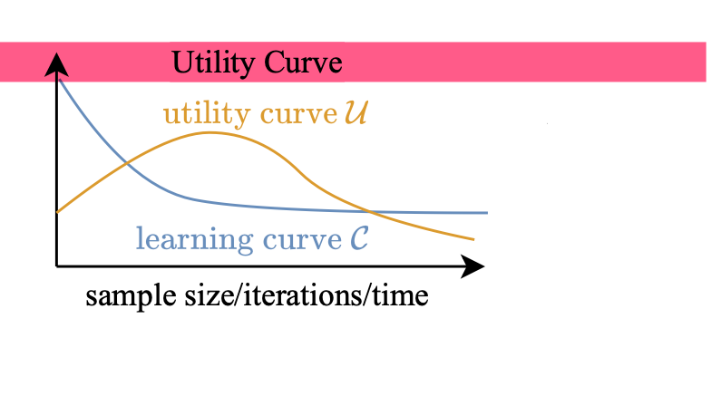
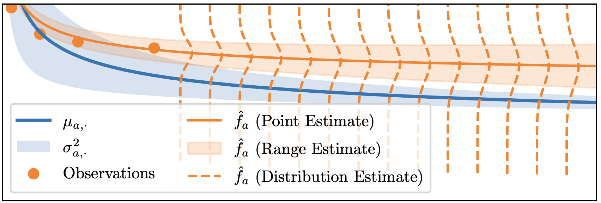
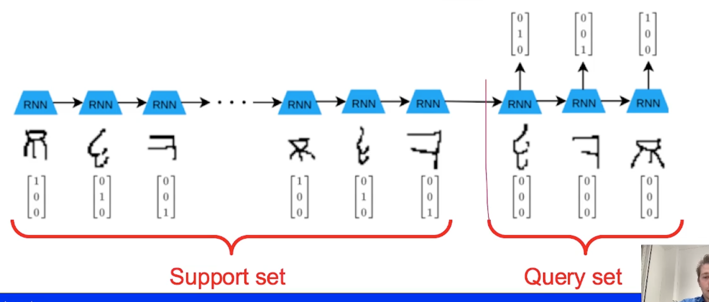

# Table of Contents

- [Algorithm Selections](#algorithm-selections)

- [Neural Architecture Search](#neural-architecture-search)
- [Learning Curves](#learning-curves)
- [LLMs](#llms)
- [Green ML](#green-ml)
- [Fairness](#fairness)
- [Meta Learning](#meta-learning)

# Algorithm Selections

- Average ranking
    - average ranks and order, domination problem

- Greedy defaults
    - select a set of algprithms on a set of datsets

- Algorithm Selection framework
    - meta accuracy and its baseline (Majority class)
    - baseline accuracy and its baseline Average best

## Studet Presentation

1. Landmarking
    - they are good, even better than combined features
2. Model based characteristics
    - train a decision tree and compute stats height/width/nun nodes at level/ len of branches/ occurence of attributes
        - check for a similar problem and use the best algprithm for that problem
    - not relevant beacuse of deep learning
    - better characterisations exist

3. Instance spaces
    - place datasets in an instance spaces
    - apply dim reduction and visualize clusters

4. AS for time series datasets
    - In a sliding window fashion use a meta learner to predict the algorithm for the upcoming datasets
    - extract meta features -> train meta learner

## Survey Paper

- StatLog
    - first to use meta featuresand regressors to predict algprithm performance, and also introduce landmarks
    - Focused on binary classification tasks

- Metal
    - focuses on more tasks / regression
    - more learning algorithms
    - **Model based characteristics**
- Lim et.al
    - Added computational time, tree size, and scalability with increasing sample size.

- Stat log is for classification what about regression
    - Kuba et al

- Optimization
    - optimization problem -> optimization algorithm

# Neural Architecture Search

## Search spaces
- Macro search space
    - search the whole topolpgy and operations

- Cell based 
    - macro structure fixed
    - search for good cells
    - by detaching the depth of an architecture from the search, the cell-based structure is transferable: the optimal cells learned on a small dataset (e.g., CIFAR-10) typically transfer well to a large dataset (e.g., ImageNet) by increasing the number of cells and filters in the overall architecture

- Hierarchical
    - compute motifs and comine them in a Hierarchical way
        - level 0 motif consists of primitive operations
        - level 1 consist of level 0

- Encoding as a adjacency matrix
    - integer values since connections bw nodes have a distinc operation with an integer encoding

## SEARCH STRATEGY
- RS and RS sampling and local search baseline

- RL
    - The controller is usually a recurrent neural network (RNN) (Zoph and Le, 2017; Zoph et al., 2018) that outputs a sequence of components corresponding to an architecture. After each outputted architec- ture is trained and evaluated, the RNN parameters are updated to maximize the expected validation accuracy of outputted architectures, using REINFORCE
- Evolutionary 
    - weight optimization is typically left to standard SGD-based approaches

- BO 
    - Using a standard GP surrogate often does not perform well for NAS, as search spaces are typically high-dimensional, non-continuous, and graph-like.
        - projects architecture information into a low-dimensional continuous latent space on which conven- tional BO can be applied effectively

    - Maximizing the acquisition function??
        - randomly mutating a small pool of the best architectures(in the acquisition function space??) queried so far and select the best one 

## One Shot Techniques

### Supernets
- linear increase in the number of candidate operations only causes a linear increase in computational costs for training, but the number of subnets in the supernet increases exponentially.
- A key assumption made in one-shot approaches is that when using the one-shot model to evaluate architectures, the ranking of architectures is relatively consistent with the ranking one would obtain from training them independently.

#### No gradient

- decopling the supernet training and acritecture search is possible

#### Yes gradient
- 4.2 DARTS
    - traing supernetwork weights w and a simultaneously
        - first train w on a (Inner level)
        - the perform gradient step on a which involves finding a'(local neighborhood of a) (Update encodinf, outer level)
            - single gradient step to approximate w*(a') from w(a) 
- SMASH
- first, train a hypernetwork to output weights for any architecture in the search space. Next, randomly sample a large set of architectures, generate their weights using the hypernetwork, and output the one with the best validation accuracy.

## Speedup

- 5.1.1 Learning Curves
    - earning curve extrapolation methods can also be used together with a surrogate model: in that case, the model takes as input both an encoding of a and a partial learning curve of a, and outputs a prediction f′(a)
- 5.1.2 Zero Cost Proxies (Low-Fidelity Predictions)
    - do a single gradient step on a set of networls and assign ranks
        - might be data independent as well just using the initialized weights or other metrics
            - surprisingly competitive results
            - are we favoring large models

## Student Presentations

- Simple Nets excell on tabular datasets
    - Optimize architecture and hyperparameters (e.g., layer size, activation functions). (BOHP)
    - Add a "regularization cocktail" to further boost performance. 
        - Regularization cocktails are an effective method of increasing performance on tabular datasets

- Zero Cost Proxies

    - Data dependent
        - Graient Norm
            - gradients calculated during backpropagation.
            - architectures with larger gradients are likely to train faster and perform better
        - Jacobian Covariance
            - correlation of neuron activations across different input samples
            - Low covariance scores indicate that the activations are diverse and potentially more effective for learning
        - Some parameter removal methods
            - High-performing architectures are typically more resilient to small changes, such as pruning a few weights
    - Data independent
        - Synflow
            - computes the product of parameter magnitudes across all layers reflects the network's capacity to maintain gradient flow

        

- Monte Carlo Tree Search
    Tree search represents traversing the architecture search space
    Upper Confidence Bound (UCB1)
    - Adds a new node to the tree, representing a new architecture.
    - Simulation: Predicts the performance of new architectures using a predictive model (Meta-DNN) rather than training them from scratch.
    - Backpropagation: Updates the statistics of the search tree by propagating the predicted performance back to the root.

- MotherNet

    - TabPFN
        - ultimate tabular hyper model which can do predictions on any tabular data
            - needs fine tuning for specific tasks? if highly domain specific

# Learning Curves

## Useful how?

- Data acquisition (sample based learning curves)(Observation Curves)

    - stream curve (stream data)
    - VERY EXPENSIVE
- Early stopping
- Early discarding
    - Horizontal (SH)
    - Vertical (LCCV , IPL)
    - Diagonal (Hyperband)

## Types

Defining utility is challenging because it combines two different types of costs:
- **Data acquisition and training time costs** (measured in time or money).
- **Model performance** (measured in metrics like accuracy or error rate).

Meek et al.’s approach avoids explicitly unifying these scales by using **implicit utility**:
- They compare the **improvement in model performance** (benefit) to the **additional runtime** (cost).
- The algorithm stops when the ratio:
  $$
  \frac{\text{Benefit Improvement}}{\text{Augmented Runtime}}
  $$
  falls below a pre-defined threshold.

## Notions

- Saturation
    - Limit has not been reached, but it has almost been reached. 

- Pre exponential
    - before diminishing returns

## Modelling Learning Curves

### Two types of uncertainity

- The aleatoric (Problem Inherent)
    - data splits
    - random weights
    - performance estimate at point s(dataset size, epochs) follows this normal distrbution (signam will decrease as s increase)
    - CV will help prevent this
$$
f(s) \sim \mathcal{N}(\mu_s, \sigma_s^2) = \mu_s + \mathcal{N}(0, \sigma_s^2)
$$

- Epistemic
    - depends on the number of observtions to model the curve
        - more samples

### Modelling

$$
\mathbb{P}(D \mid \beta_1, \dots, \beta_m)
$$

- D: observed anchors

- If extrapolating regular regression might suck

### Modelling with range estimates

### Types of questions

- Binary
- value queries
- Models of curves 
- curve portfolio 

## Student Presentations

- ### Estimating $ n^* $

1. **Collect Data**:
d
     - Train model, compute $ \text{err}(n_i) $on some anchors.

2. **Fit Models**:
   - Fit $ \text{err}(n) $ to candidate functions (logarithmic, power law, etc.).
   - Select best fit using Pearson correlation.
   - Fit $ \text{CPU}(n) $ (e.g., linear).

5. **Total Cost**:
   $$
   \text{Total Cost}(n) = n \cdot C_\text{tr} + \text{CPU}(n) \cdot C_\text{time} + \text{err}(n) \cdot |\mathcal{S}| \cdot C_\text{err}
   $$

6. **Optimize**:
   $$
   \frac{d}{dn} \text{Total Cost}(n) = 0
   $$
   Solve for $ n^* $.

- ### Finding the Utility-Based Stopping Point

- #### Utility Metric

$$
\text{Total Cost} = n \cdot C_\text{tr} + e \cdot |\mathcal{S}| \cdot C_\text{err}
$$

- **$ n $**: Training set size  
- **$ C_\text{tr} $**: Cost per training data point  
- **$ e $**: (Predicted) error rate  
- **$ |\mathcal{S}| $**: Score set size  
- **$ C_\text{err} $**: Cost per error  

    compute this at every anchor and stop when it increases

- ### Performance Prediction at a fixed point

1. **Input**: 
   - Set of previous learning curves $ \{y_1, y_2, \dots, y_k\} $ (fully trained).
   - Current incomplete learning curve $ y_\text{current} $ (few epochs).
   - Threshold performance $ p_\text{threshold} $.

2. **Affine Transformation**:
   - For each previous curve $ y_i $ apply affine transformation to resemble $y_{current}$

4. **Prediction**:
   - Compute the weighted average of transformed predictions:
     $$
     \hat{y}_\text{current} = \sum_i w_i \cdot \hat{y}_i
     $$

- ### Performance Bounding

- **DAUB (Data Allocation Using Upper Bounds)**:
  - **Horizontal Model Selection**: Compares multiple models at the same dataset size (anchor points).
  - Uses **linear extrapolation** between two small anchor points to estimate optimistic performance bounds.
  - Focuses on **resource allocation** to promising models.

- **LCCV (Learning Curve Cross-Validation)**:
  - **Vertical Model Selection**: Evaluates models across increasing dataset sizes (progressively larger anchor points).
  - Uses extrapolation and **convexity assumptions** to prune underperforming models.
  - Focuses on **early elimination** of unlikely candidates.

# LLM'S

## Challeges in Auto ML for LLMS
- expensive to train models
    - Prior-Guided Multi-Fidelity Optimization with Scaling Laws
- accuracy metric?
- different modalities
- many cycles

## Student Presentations
- ### Fine-Grained Reinforcement Learning from Human Feedback (RLHF)

    - alignment fine tuning
    - Label the data with sub-sentence level feedback, with these categories
    - Train a Reward Model network for each category based on the human feedback
    - use ppo to fine tune the policy(LLM)

- ### Automatic Prompt Engineering (APE)

### Step 1: Proposal
- Generate candidate prompts based on input-output examples.
- Methods:
  1. **Forward Mode**: Generate prompts starting from inputs.
  2. **Reverse Mode**: Work backward from outputs.
  3. **Customized Prompts**: Tailored to specific tasks.

### Step 2: Scoring
- Evaluate prompts using:
  - **Execution Accuracy**: Correctness of output.
  - **Log Probability**: Confidence of the model.

### Step 3: Candidate Selection
- Filter high-scoring prompts for refinement.
- Use subsets of data to save computation.

### Step 4: Refinement
- Improve selected prompts via paraphrasing.
- Ensure generality and clarity.

### Step 5: Final Selection
- Pick the best-performing prompt for deployment.

### Example: Summarization Task

### Input-Output Example:
- **Input**: "Climate change causes severe weather and rising sea levels."
- **Output**: "Climate change worsens global warming and its effects."

### Candidate Prompts:
1. "Summarize the following text in one sentence."
2. "Condense this text into a concise summary."

### Scoring:
- Execution Accuracy = 1 for both.
- Log Probability:
  - Prompt 1: -2.3
  - Prompt 2: -2.6

### Final Prompt:
"Provide a one-sentence summary of this text."

## LLMs for Configuring AutoML
- search space?
- how long to run?
    - llm can tell

- ### AutoML-GPT

        # Step 1: Generate Initial Architecture
        architecture = LLM.suggest_architecture(task_description, dataset)

        # Step 2: Predict Training Performance
        predicted_log = LLM.predict_training_log(architecture, dataset)

        # Step 3: Evaluate Prediction
        if predicted_log.performance < threshold:
            discard(architecture)  # Skip poor-performing architectures
            return NAS_with_LLM(task_description, dataset)  # Suggest a new one

        # Step 4: Refine Hyperparameters (Optional)
        architecture = LLM.refine_hyperparameters(architecture, predicted_log)

        # Step 5: Train and Validate
        trained_model, real_performance = train(architecture, dataset)
        
        # Step 6: Feedback Loop
        LLM.update_feedback(architecture, real_performance)

        return trained_model, real_performance

- ### LLMBAO

#### Warmstarting:
- Normally, Bayesian Optimization starts with little or no knowledge.
- LLAMBO gives it extra information, like:
  - Details about the dataset (*data card*).
  - Details about the machine learning model being optimized (*model card*).
- This helps BO start off with better guesses.

#### Candidate Sampling:
- When BO needs to pick the next settings to try, LLAMBO uses an LLM to propose smarter guesses.
- It looks at past results and suggests new settings that balance between exploring new ideas and exploiting what already works.

#### Surrogate Modeling:
- The surrogate model tries to predict the outcomes of trying different settings.
- LLAMBO uses an LLM to analyze the optimization history, written in natural language, to improve these predictions.

# Green ML

- undemocratic research area
    - access crazy amount of cpus

- depends on the compute science as well

## How to use less energy

- ### Warm start models
    - task resemblence -> dataset meta features and have an order of configs
    - start on a good solution and stop early
- ### Zero shot models
    - only evaluate a single model / extreme warm starting

- ### Timeout models

    - predict the runtime -> dataset meta features
    - cpmpare to a threhold
        - dont train at all
- ### Low fidelity performance

- ### Energy Consumption as an Objective

    - have energy consumption as  seperate Objective
    - Merge with the accuracy Objective
    - In BO
        - have EIKWh -> EI per KWh

- ### AutoML

    - commit to some choices early before HPO -> algorithm and preprocesses (be greedy)

## Student Presentations

- ### CarBO
    - CarBO adjusts its exploration strategy to prioritize regions of the search space with lower evaluation costs -> prior knowledge
    - Scale your EI() inveresly with the c(x)  -> cx is the surrogate model on cost

- ### Cost Aware BO
    - Constraint the acquisition function space with some power constraints -> also have some surrogate models for these 

    - Implement checks during evaluations to terminate unpromising or resource-intensive trials.

# Fairness 

- facial recognition fails on dark skinned women
- gender bias in resume paraphrasing

- solutions to problems dont carry to other problems
    - *solutions in AutoML do carry*

**Why dont remove sensitive datasets?**
- attribute leak to other attributes (still captured)

## Fairness metrics

### Group Fairness
we want some metrics to match accross sensitive attributes
    - metric: accuracy, average predicted value

1. Equalized Odds
    - Classification 
        - accuracy should match on groups
    - Regression 
        - mse should match -> **Won't solve the bias in the data** 

2. Demographic Parity
    - P(R=1| group= a) = P(R= 1)
    - No dependency on the true label.
    - label is not in the data -> fix historical bias
    - If historically fewer women were approved for loans (due to bias), demographic parity will enforce equal loan approvals for men and women regardless of past data.

## Fairness-aware ML
- pre-processing

    - adjust the data to obscure any undesirable associations between sensitive features and a target variabl

- In-processing
    - fairness constrained BO

- Post-processing
    - fine tue model

### Note

High regularization is shown to reduce unfairness in models

### bias

- representation bias
    - less data on groups

- measurement bias

- Historichal bias: A hiring algorithm trained on historical resumes might favor male candidates because historically, men have held more leadership positions.

### Fairness metric failure cases
- Equalized odds -> improve group fairness by decreasing performance on the privviliged group

- Demographic parity: Invite lower-ranked applicants to interview (from the unfair group)

### Use of the system

How humans decide to use the system also intorduces a bias -> Human Bias

## Student Presentations

- ### Fairness Constraints

    - Two metrics
        - p%= This metric measures fairness by ensuring the ratio of the positive outcome rate for a sensitive group to that of the non-sensitive group is not below a certain percentage (Benchmark)
        -  minimizes the covariance between the sensitive attribute and the decision boundary of the model. (train the svm regarding this either as a constraint or objective)

- ### FairBO

    - Additional GP c(x) to model the fairness constraint alongside the GP for the target
    - cEI(x) = EI(x)P(c(x) ≤ 𝜖) -> P(c(x) ≤ 𝜖) obtained from CDF of c(x)

    - ### Metrics used: (the classic ones)
        #### 1. Difference in Equal Opportunity (DEO):
        - Ensures fairness in true positive rates across sensitive groups.

        #### 2. Difference in False Positive Rates (DFP):
        - Ensures fairness in false positive rates across sensitive groups.

        #### 3. Difference in Statistical Parity (DSP):
        - Ensures fairness in positive predictions across sensitive groups.

- ### Fair facial reccognition

    - Do the neurol network acrhitecture and HP affect the fairness?
        - yes
    Start from the ground up for a fairer approach and not use exising architectures
    - Can we conclude that these architectures are tuned without concerning fariness so -> unfair acrhitectures

        

# Meta Learning

## Deep Meta-Learning

Deep learning models are *inefficient* learners

## Few Shot Learning

- Split at the class level -> generalize to unseen data

- Not episodic training
    - sample random batches of data (no episode structure)

- fine tuning the classification dense layer 

## Categories of meta learning methods

### Metric based

- **Matching network**
    - weighted averge of support set labels -> weights: softmax normalized cos similarity
    - Scalability problem: each query needs each support image to instance (Adressed by prototypical networks)

- **prototypical networks**
    - compute class centroids by averaging embedding vectors
    - 

### Optimization Based

**Parametirc** parameters adjusted for task in interest as opposed to metric learning 

- **MAML**: learn good initial parameters for a set of tasks
    - **Minimize** query loss on each tasks after T gradient steps from the suggested Theta (specific for J?)

    - **Expensive** second order gradients -> quadratic in network parameters
        - First order approximation -> FO-MAML

- **Reptile**
    - average trained weights on support set (almost)
    - many hyperparams !!

### Model Based

- encapsulate learning in an RNN state -> theory backs it up
- flexible

## Student Presentations

- ### Meta loss
    - model the loss function using NN with a meta learning fashion

- ### Meta-Q learning
    - Task-Independent Policy: A general policy that performs well across multiple tasks during meta-training.

    - Task-Specific Adaptation: Using minimal new data, the agent refines its behavior for a specific task.

    The context variable is:
        - A dynamically updated latent representation.
        - Generalized during meta-training and refined during task adaptation.
        - Crucial for fast, efficient, and task-specific reinforcement learning
    
- ### t_nas

- ### Meta Dropout

Data Augmentation for few shot learning

- reduces overfitting 

Meta-dropout: Learn an input-deepndent noise distrbution

- improve decision boundries!!

Can't do dropout in few shot learning!!
- not enough data points

Noise generation process takes the input image and applies a specific noise to the images

